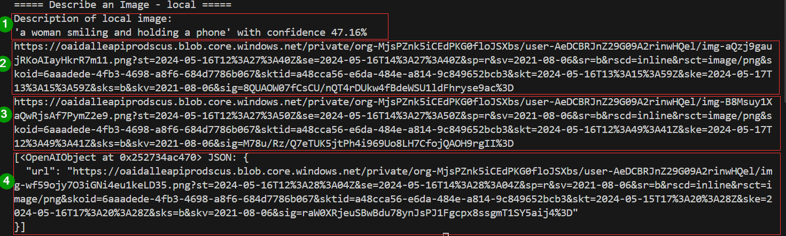
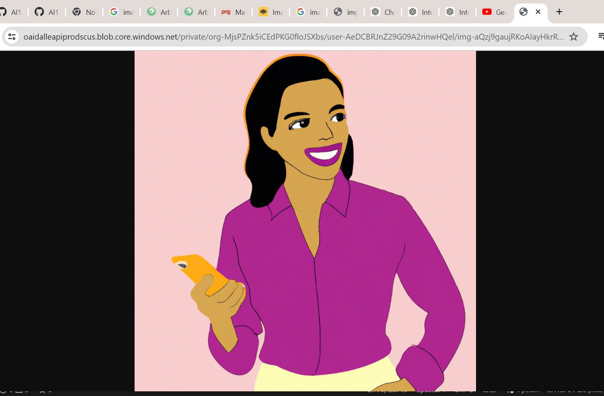
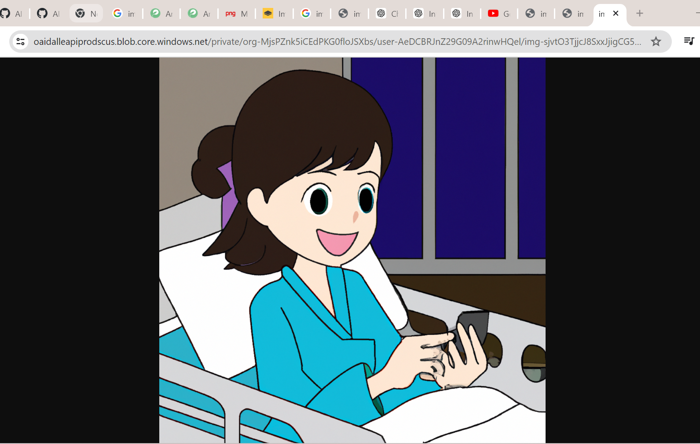
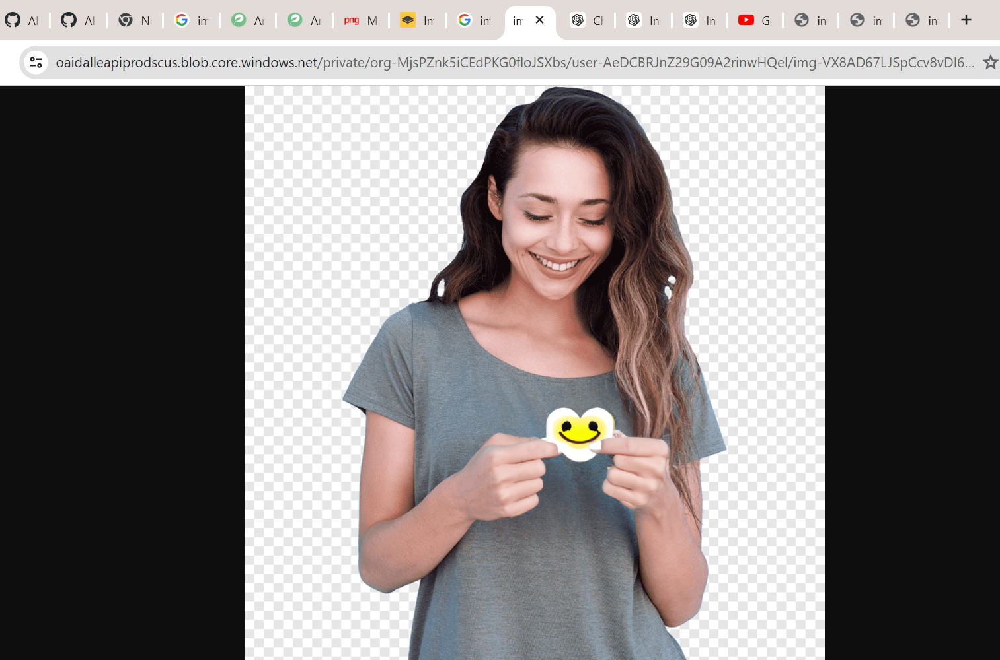

    title: Projet Géneration de variation d'images via un prompt
    authors:
        - Mohamed Aziz NABI
        - Yosra CHAABOUNI
        - Ahlem ELAYEB
    date: 2024-05-14
    geometry:
        - top=20mm
        - left=20mm
        - right=10mm
        - bottom=10mm
        - heightrounded
    bibliography: [biblio.bib]

## Sujet

On souhaite créer un programme qui est capable de génerer une variation d'une image. On lui fournit une `image d'origine`, un `prompt` de modification et l'IA fournis un prompt de sortie et l'image associée.Le but est la modification de style, la recontextualisation de personnages et d'objets.On est limité par les coûts à l'utilisation, et on peut uniquement utiliser `Azure` et `Open AI` (avec parcimonie).

## Etat de l'art

##### Objectif
Le projet vise à créer un programme capable de générer des variations d'images en fonction d'un prompt de modification, en utilisant les services Azure et OpenAI.

##### Contexte
Ce programme sera utilisé principalement pour la modification de style d'images, ainsi que la recontextualisation de personnages et d'objets. Par exemple, il pourrait être utilisé pour transformer une photo en un style artistique spécifique ou pour ajouter ou modifier des éléments dans une scène.

##### Contraintes
Nous devons tenir compte des coûts d'utilisation des services Azure et OpenAI, en nous assurant de les utiliser de manière efficiente. De plus, notre solution doit exclusivement utiliser les fonctionnalités fournies par ces deux plateformes.

##### Outils utilisé et alternatives 

1/ API Azure Computer Vision :

Description : nous avons utilisé l'API Azure Computer Vision pour extraire des informations à partir d'une image, en l'occurrence, nous avons extrait une description de l'image.
Fonctionnalités : L'API Azure Computer Vision offre diverses fonctionnalités telles que la description d'images, la reconnaissance optique de caractères (OCR), la détection de célébrités, la reconnaissance de la langue et bien d'autres.
Travail : on a crée une nouvelle ressource computer vision ou on récupére le KEY ET l'endpoint utilisé dans notre code 

Alternatives :
Google Cloud Vision API : Une alternative à Azure Computer Vision proposée par Google, offrant des fonctionnalités similaires telles que la description d'images, la détection de visages, etc.
Amazon Rekognition : Un service AWS offrant des fonctionnalités de vision par ordinateur pour l'analyse d'images et de vidéos, y compris la détection d'objets, la reconnaissance faciale, etc.

2/ API DALL-E d'OpenAI :
Description : Nous avons utilisé l'API DALL-E d'OpenAI pour générer de nouvelles images à partir d'une description textuelle.
Fonctionnalités : L'API DALL-E est capable de générer des images réalistes en fonction de descriptions textuelles données en entrée, explorant ainsi des concepts visuels imaginatifs.
travail : on a crée un openaiKEY 
Alternatives :
GPT-3 d'OpenAI : Bien que principalement un modèle de génération de texte, GPT-3 peut également être utilisé pour générer des images en utilisant des descriptions textuelles.
CLIP d'OpenAI : CLIP est un modèle de vision par ordinateur capable d'associer des images et des textes dans un espace de représentation commun, permettant ainsi la génération d'images à partir de descriptions textuelles.

##### Clées utilisées 
Toutes nos clés sont stockées dans le fichier apikey.py, à l'exception de la clé OpenAI que nous avons laissée telle quelle dans le code, car c'est vous qui nous l'avez fournie.

## Architechture

L'architecture du programme peut être structurée comme suit :
##### Prétraitement de l'image :
- Extraction de la Description de l'Image : Utilisation de l'API Azure Computer Vision pour extraire une description de l'image téléchargée localement.
- Normalisation de l'Image : Redimensionnement et normalisation de l'image pour la rendre compatible avec les modèles d'IA.

##### Génération de Prompts :
- Analyse des Besoins Utilisateur : Interprétation des besoins de l'utilisateur pour définir les modifications souhaitées, telles que la génération d'une nouvelle scène.
- Création de prompts précis et adaptés basés sur la description extraite de l'image.

##### Utilisation de Modèles d'IA :

- Sélection du Modèle : Choix de l'API DALL-E d'OpenAI pour générer de nouvelles images à partir des prompts formulés.
- Envoi des Prompts et des Images : Transmission des prompts et des images prétraitées à l'API DALL-E pour la génération d'images.

##### Traitement des Réponses des Modèles :
- Récupération des Résultats : Collecte et interprétation des résultats générés par l'API DALL-E, tels que les URL des nouvelles images.

##### Post-traitement des Résultats :
- Optimisation de l'Image : Optimisation de l'image sélectionnée si nécessaire, par exemple, en appliquant des modifications supplémentaires à l'aide de l'API OpenAI Image Editing qu'on a utilisé en bonus 

#### Bibliographie : 
https://www.youtube.com/shorts/kqfs683snH0
https://www.youtube.com/watch?v=UkvFsyPk6LY&t=845s

##### Erreurs que nous avons rencontrés 
Durant notre travail, nous avons rarement rencontré des erreurs, grâce à notre habitude de mener des recherches approfondies avant de procéder. Cependant, nous avons commis une erreur en dépassant le nombre de tentatives autorisées pour l'API OpenAI du coup on récupéré votre clés, ce qui s'est produit dans la première phase de notre projet. De plus, nous avons dû effectuer une mise à niveau de la version OpenAI pour résoudre un problème.

Dans la deuxième partie, lors de la tentative de description de texte avec OpenAI, nous avons dû convertir l'image en format base64, parmi d'autres tâches. Nous avons également rencontré des difficultés avec les modèles ChatGPT. Cependant, nous avons réussi à tout résoudre en passant à Azure Computer Vision, où nous avons créé et récupéré l'endpoint et les clés nécessaires.
Dans la dernière partie, nous avons rencontré des problèmes avec la combinaison de la description générée par Azure et les entrées utilisateur via le prompt. Bien que nous ayons initialement tenté de stocker les entrées utilisateur dans des variables, nous avons finalement opté pour une approche directe en combinant le texte avec la sortie d'Azure. En résumé, voici les principaux obstacles auxquels nous avons été confrontés.
#### partie WEB
Pour la partie interface web, nous avons développé une section qui fonctionne en exécutant le fichier `interface.py`. Cela nous fournit l'URL, mais nous avons ensuite rencontré des erreurs lors du téléchargement du fichier.

explication : 
1) generation d'une descritpion a partir d'une image donnée 
test : descrption généré 
2) genereration d'une image a partir de la description de la partie 1 :

3) modification de l'image selon un prompt qui récupere le texte de l'utilisateur avec la description générée dans la partie 1 

4) partie bonus : edit d'une image a partir d'un mask et texte donné 

